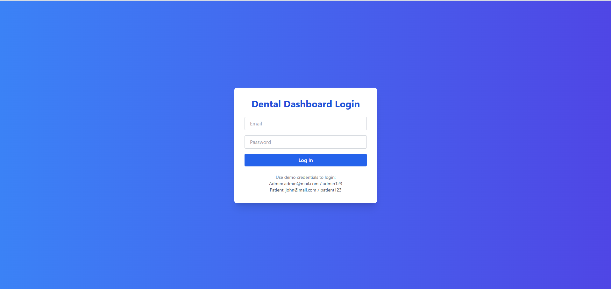
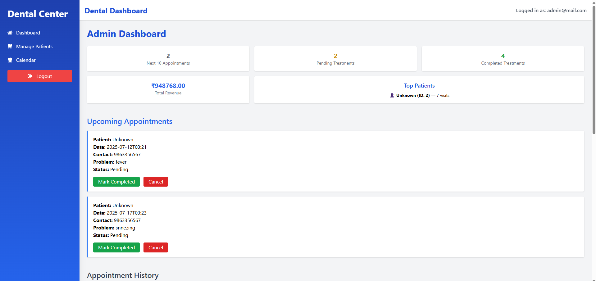
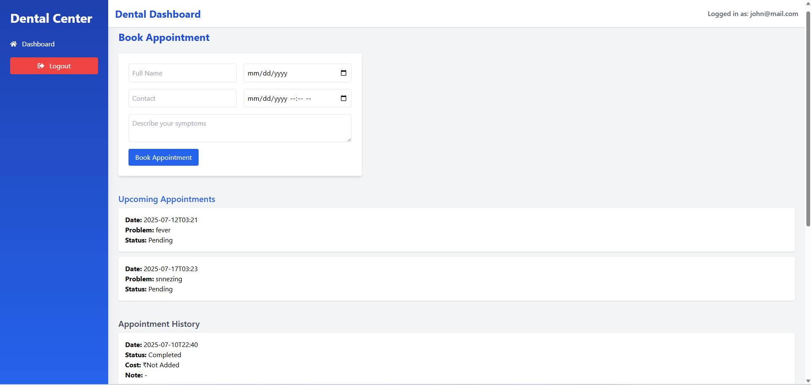
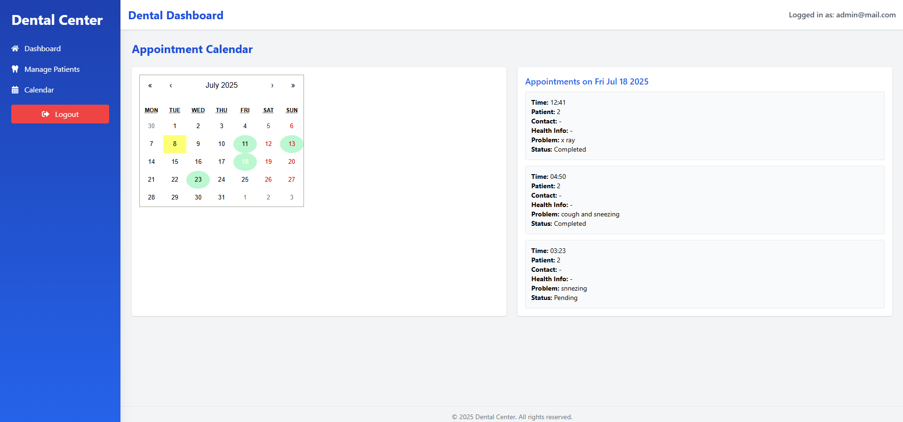
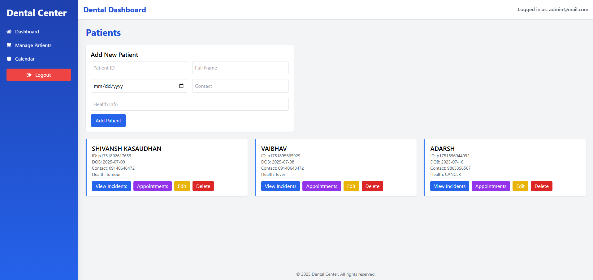

# 🦷 Dental Dashboard (Frontend Only)

A fully functional dental center management system for **Admins and Patients** — built using **React**, **Tailwind CSS**, and **Context API**, with all data handled through `localStorage`. This project simulates a realistic appointment system workflow without using any backend, API, or database.

---

## 🔗 Deployed App  
👉 [https://dental-dashboard-five.vercel.app](https://dental-dashboard-five.vercel.app)

## 📁 GitHub Repo  
👉 [https://github.com/shiva3187/dental-dashboard](https://github.com/shiva3187/dental-dashboard)

---

## 🧑‍⚕️ Login Credentials

| Role    | Email             | Password   |
|---------|-------------------|------------|
| Admin   | admin@mail.com    | admin123   |
| Patient | john@mail.com     | patient123 |

---

## 📸 Screenshots

| Page                | Preview                                                                 |
|---------------------|-------------------------------------------------------------------------|
| Login Page          |                                    |
| Admin Dashboard     |                               |
| Patient Dashboard   |                           |
| Calendar View       |                               |
| Patients Management |                            |

---

## 🛠️ Tech Stack

- ⚛️ React (CRA)
- 🧭 React Router v6
- 💼 Context API (Authentication)
- 💨 Tailwind CSS
- 🗂️ localStorage (persistence)
- 📤 File Upload & Preview (Images, PDFs)

---

## 📌 Core Features

### 🔐 Role-based Authentication
- Two hardcoded user roles: Admin & Patient
- Session stored in `localStorage`

---

### 👨‍⚕️ Admin Features
- KPIs: Revenue, Top Patients, Upcoming Appointments
- Calendar: Green dates indicate appointments; click to view
- Add/Edit/Delete Patients
- View & manage incidents per patient
- Appointment history with fee and notes
- Complete/Cancel appointments with payment modal
- Automatic patient creation if new patient books

---

### 👤 Patient Features
- Book appointment: Name, DOB, Contact, Symptoms, Date
- View upcoming appointments
- See appointment history with fee & comments
- Upload attachments during incident/treatment

---

## 🧠 Architecture

